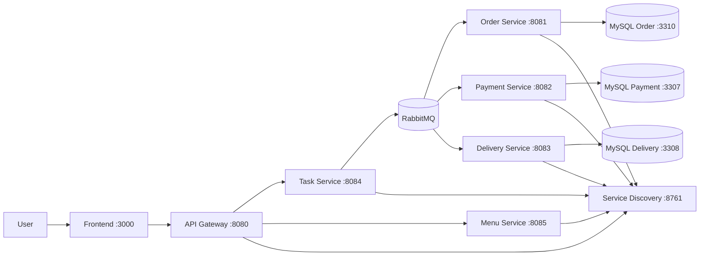

# Restaurant Order Management - SOA Microservices

[](https://github.com/hungdn1701/microservices-assignment-starter/stargazers)
[](https://github.com/hungdn1701/microservices-assignment-starter/network/members)

> Hệ thống tự động hóa quy trình đặt món cho nhà hàng theo kiến trúc SOA/Microservices, điều phối giao dịch phân tán bằng Saga Orchestration và giao tiếp bất đồng bộ qua RabbitMQ.

> **New to this repo?** See [`GETTING_STARTED.md`](GETTING_STARTED.md) for setup instructions and workflow guide.

---

## Team Members

| Name | Student ID | Role | Contribution |
| ---- | ---------- | ---- | ------------ |
|      |            |      |              |
|      |            |      |              |
|      |            |      |              |

---

## Business Process

Hệ thống phục vụ quy trình đặt đơn cho nhà hàng đơn với các tác nhân chính gồm khách hàng, hệ thống đặt món (Frontend/Gateway) và các microservice nghiệp vụ. Luồng chính gồm: tạo đơn hàng -> xử lý thanh toán -> phân công giao hàng -> cập nhật trạng thái hoàn tất hoặc hủy đơn.

Phạm vi bài toán tập trung vào tính nhất quán dữ liệu giữa nhiều service thông qua Saga Orchestration tại Task Service, trong đó mỗi bước nghiệp vụ được phát và xử lý qua event RabbitMQ.

---

## Architecture



| Component             | Responsibility                                              | Tech Stack             | Port        |
| --------------------- | ----------------------------------------------------------- | ---------------------- | ----------- |
| **Frontend**          | UI đặt món, gọi API qua Gateway                             | Frontend App + Nginx   | 3000        |
| **Gateway**           | API Gateway route request tới các backend service           | Spring Cloud Gateway   | 8080        |
| **Task Service**      | Saga Orchestrator, publish/consume event điều phối đơn hàng | Spring Boot + RabbitMQ | 8084        |
| **Order Service**     | Tạo đơn, lưu trạng thái đơn hàng                            | Spring Boot + MySQL    | 8081        |
| **Payment Service**   | Xử lý thanh toán, phát kết quả thành công/thất bại          | Spring Boot + MySQL    | 8082        |
| **Delivery Service**  | Gán giao hàng, phát sự kiện delivery.assigned               | Spring Boot + MySQL    | 8083        |
| **Menu Service**      | Cung cấp dữ liệu menu cho frontend                          | Spring Boot            | 8085        |
| **Service Discovery** | Service registry cho các microservice                       | Eureka Server          | 8761        |
| **RabbitMQ**          | Message broker cho giao tiếp bất đồng bộ                    | RabbitMQ               | 5672, 15672 |

> Full documentation: [`architecture.md`](architecture.md) · [`analysis-and-design-new.md`](analysis-and-design-new.md) · [`docs/saga-orchestration-single-restaurant.md`](docs/saga-orchestration-single-restaurant.md)

---

## Getting Started

```bash
# Clone and initialize
git clone <your-repo-url>
cd <project-folder>
cp .env.example .env

# Build and run
docker compose up --build
```

### Verify

```bash
curl http://localhost:8080
curl http://localhost:8761
curl http://localhost:8084/task/health
curl http://localhost:8081/order/health
curl http://localhost:8082/payment/health
curl http://localhost:8083/delivery/health
curl http://localhost:8085/menu/health
```

---

## API Documentation

- [Task Service - OpenAPI Spec](docs/api-specs/TaskService.yaml)
- [Order Service - OpenAPI Spec](docs/api-specs/OrderService.yaml)
- [Payment Service - OpenAPI Spec](docs/api-specs/PaymentService.yaml)
- [Delivery Service - OpenAPI Spec](docs/api-specs/DeliveryService.yaml)
- [Menu Service - OpenAPI Spec](docs/api-specs/MenuService.yaml)

---
