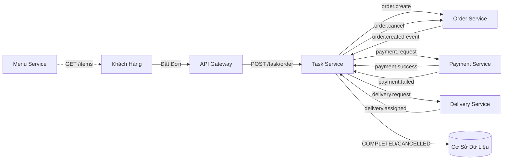
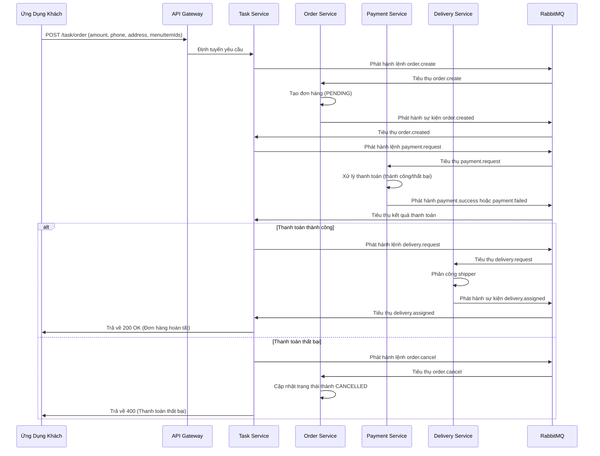
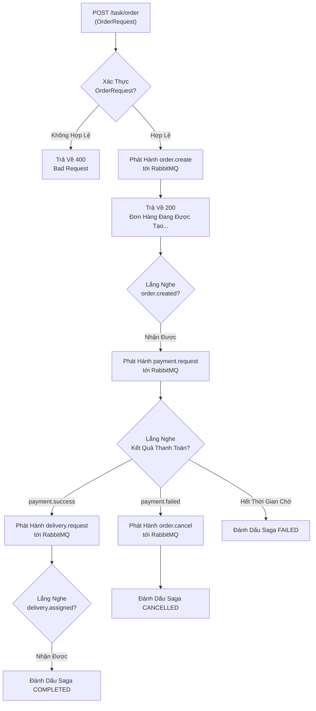
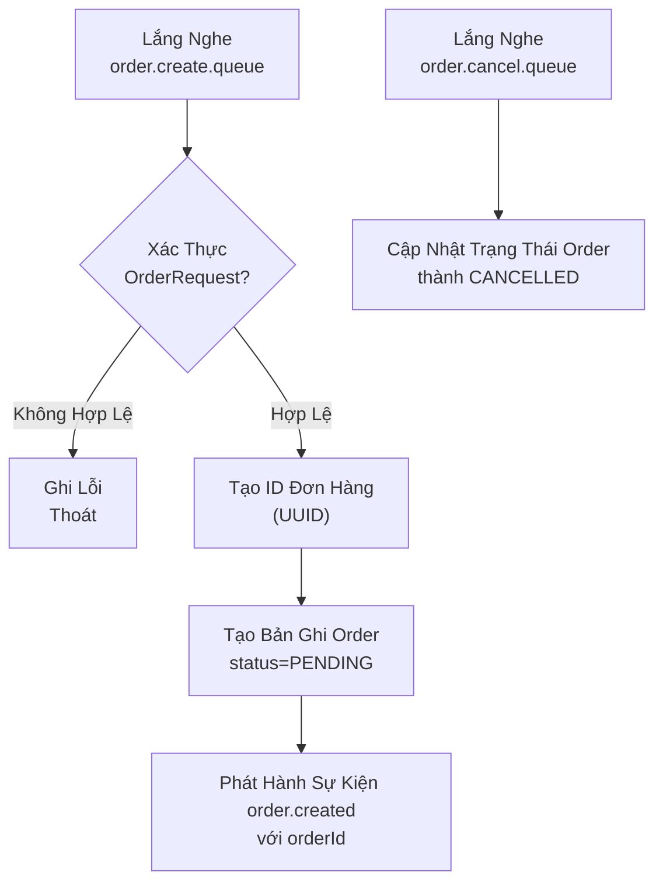
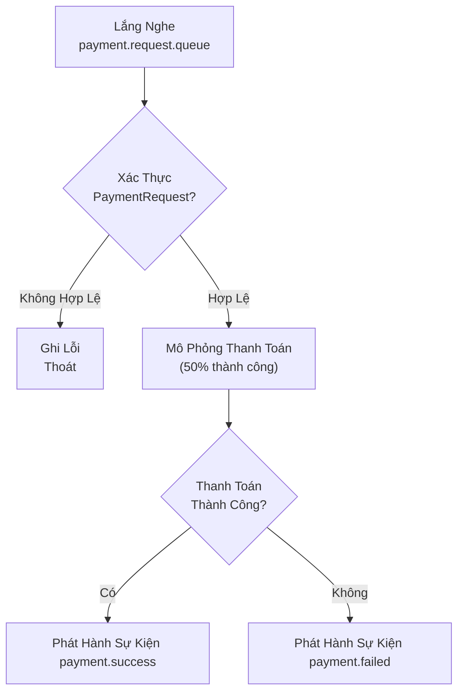
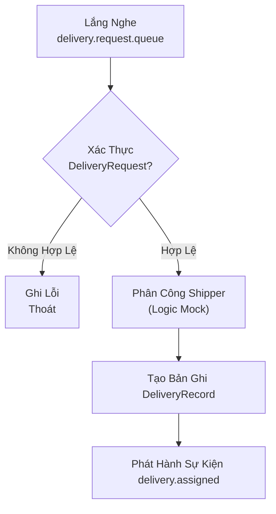
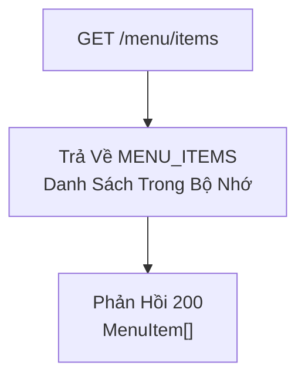

# Analysis and Design — Business Process Automation Solution

> **Goal**: Analyze a specific business process and design a service-oriented automation solution (SOA/Microservices).
> Scope: 4–6 week assignment — focus on **one business process**, not an entire system.

**References:**

1. _Service-Oriented Architecture: Analysis and Design for Services and Microservices_ — Thomas Erl (2nd Edition)
2. _Microservices Patterns: With Examples in Java_ — Chris Richardson
3. _Bài tập — Phát triển phần mềm hướng dịch vụ_ — Hung Dang (available in Vietnamese)

---

## Part 1 — Analysis Preparation

### 1.1 Business Process Definition

Describe or diagram the high-level Business Process to be automated.

- **Domain**: Hệ thống quản lý đơn hàng cho nhà hàng đơn (Single Restaurant Order Management System)
- **Business Process**: Khách hàng đặt đơn → Thanh toán → Giao hàng → Hoàn tất
- **Actors**:
  - Khách Hàng (Customer): Đặt đơn hàng và nhận hàng giao
  - Hệ Thống (System): Xử lý đơn hàng thông qua công cụ điều phối
  - Dịch Vụ Thanh Toán (Payment Service): Xử lý các giao dịch thanh toán
  - Dịch Vụ Giao Hàng (Delivery Service): Quản lý phân công shipper và vận chuyển
  - Dịch Vụ Menu (Menu Service): Cung cấp danh sách món ăn có sẵn
- **Scope**: Quản lý đơn hàng từ đầu đến cuối cho một nhà hàng; không bao gồm quản lý menu phức tạp, tích hợp cổng thanh toán thực, và theo dõi shipper theo thời gian thực

**Process Diagram:**

### 1.2 Existing Automation Systems

List existing systems, databases, or legacy logic related to this process.

| System Name | Type          | Current Role  | Interaction Method |
| ----------- | ------------- | ------------- | ------------------ |
| Không có    | Không áp dụng | Không áp dụng | Không áp dụng      |

> Không có — quy trình này hiện được thực hiện hoàn toàn thủ công qua email, điện thoại và quản lý trực tiếp trên giấy. Đây là dự án xây dựng từ đầu (greenfield).

### 1.3 Non-Functional Requirements

Non-functional requirements serve as input for identifying Utility Service and Microservice Candidates in step 2.7.

| Requirement  | Description                                                                                                                                         |
| ------------ | --------------------------------------------------------------------------------------------------------------------------------------------------- |
| Performance  | Thời gian phản hồi dưới 2 giây cho yêu cầu đặt đơn; xử lý thanh toán dưới 5 giây                                                                    |
| Security     | Xác thực qua JWT token; mã hóa dữ liệu nhạy cảm; kiểm soát truy cập dựa trên vai trò (RBAC) trong Phase 2                                           |
| Scalability  | Hỗ trợ mở rộng ngang (horizontal scaling) thông qua Docker/Kubernetes; xử lý tăng 10x lưu lượng truy cập trong giờ cao điểm mà không giảm hiệu năng |
| Availability | SLA thời gian hoạt động 99.5%; suy giảm dịu dàng khi các dịch vụ gặp sự cố; hủy đơn hàng vẫn khả dụng khi Order Service gặp sự cố                   |

---

## Part 2 — REST/Microservices Modeling

### 2.1 Decompose Business Process & 2.2 Filter Unsuitable Actions

Decompose the process from 1.1 into granular actions. Mark actions unsuitable for service encapsulation.

| #   | Action                               | Actor                        | Description                                                          | Suitable? |
| --- | ------------------------------------ | ---------------------------- | -------------------------------------------------------------------- | --------- |
| 1   | Nhận yêu cầu đặt đơn                 | API Gateway                  | Tiếp nhận yêu cầu HTTP từ khách hàng                                 | ✅        |
| 2   | Xác thực dữ liệu đơn hàng            | Task Service                 | Kiểm tra các trường bắt buộc (số tiền, điện thoại, địa chỉ, ID menu) | ✅        |
| 3   | Tạo bản ghi đơn hàng                 | Order Service                | Lưu trữ đơn hàng với trạng thái PENDING                              | ✅        |
| 4   | Phát hành sự kiện order.created      | Order Service                | Thông báo không đồng bộ tới công cụ điều phối                        | ✅        |
| 5   | Yêu cầu thanh toán                   | Payment Service              | Kiểm tra ID đơn hàng có tồn tại, số tiền > 0                         | ✅        |
| 6   | Xử lý thanh toán                     | Payment Service              | Mô phỏng kết quả thanh toán (thành công/thất bại 50%)                | ✅        |
| 7   | Phát hành kết quả thanh toán         | Payment Service              | Gửi sự kiện payment.success hoặc payment.failed                      | ✅        |
| 8   | Cập nhật trạng thái đơn hàng         | Task Service / Order Service | Chuyển tiếp trạng thái trong công cụ điều phối                       | ✅        |
| 9   | Tạo yêu cầu giao hàng                | Delivery Service             | Phân công shipper, tạo ID giao hàng                                  | ✅        |
| 10  | Phát hành sự kiện delivery.assigned  | Delivery Service             | Thông báo hoàn tất đơn hàng                                          | ✅        |
| 11  | Hủy đơn hàng khi thanh toán thất bại | Order Service                | Rollback trạng thái đơn hàng về CANCELLED                            | ✅        |
| 12  | Theo dõi shipper realtime            | Delivery Service             | Cập nhật vị trí shipper theo thời gian thực (ngoài phạm vi)          | ❌        |
| 13  | Đánh giá rủi ro thủ công             | Người Vận Hành Hệ Thống      | Kiểm tra gian lận thủ công (ngoài phạm vi)                           | ❌        |

> Actions marked ❌: manual-only, require human judgment, or cannot be encapsulated as a service.

### 2.3 Entity Service Candidates

Identify business entities and group reusable (agnostic) actions into Entity Service Candidates.

| Entity               | Service Candidate | Agnostic Actions                                                   |
| -------------------- | ----------------- | ------------------------------------------------------------------ |
| Đơn Hàng (Order)     | Order Service     | Tạo đơn hàng, cập nhật trạng thái, hủy đơn hàng, phát hành sự kiện |
| Thanh Toán (Payment) | Payment Service   | Xác thực yêu cầu thanh toán, xử lý thanh toán, phát hành kết quả   |
| Giao Hàng (Delivery) | Delivery Service  | Tạo yêu cầu giao hàng, phân công shipper, cập nhật trạng thái      |
| Menu (Menu Catalog)  | Menu Service      | Liệt kê các mục menu, trả về danh sách hàng hóa                    |

### 2.4 Task Service Candidate

Group process-specific (non-agnostic) actions into a Task Service Candidate.

| Non-agnostic Action                                                                                  | Task Service Candidate           |
| ---------------------------------------------------------------------------------------------------- | -------------------------------- |
| Điều phối quy trình đặt đơn → thanh toán → giao hàng                                                 | Task Service (Saga Orchestrator) |
| Định tuyến sự kiện order.created sang lệnh payment.request                                           | Công Cụ Điều Phối                |
| Định tuyến payment.success sang lệnh delivery.request                                                | Công Cụ Điều Phối                |
| Định tuyến payment.failed sang lệnh order.cancel                                                     | Công Cụ Điều Phối                |
| Theo dõi trạng thái saga (ORDER_CREATED, PAYMENT_PROCESSING, DELIVERY_ASSIGNED, COMPLETED/CANCELLED) | Công Cụ Điều Phối                |

### 2.5 Identify Resources

Map entities/processes to REST URI Resources.

| Entity / Process        | Resource URI                                                                     |
| ----------------------- | -------------------------------------------------------------------------------- |
| Tạo đơn hàng            | POST /task/order                                                                 |
| Xem trạng thái hệ thống | GET /task/health, /order/health, /payment/health, /delivery/health, /menu/health |
| Liệt kê menu            | GET /menu/items                                                                  |
| Xác thực dịch vụ        | GET /\*/health                                                                   |

### 2.6 Associate Capabilities with Resources and Methods

| Service Candidate | Capability                                           | Resource         | HTTP Method |
| ----------------- | ---------------------------------------------------- | ---------------- | ----------- |
| Task Service      | Đặt đơn hàng                                         | /task/order      | POST        |
| Task Service      | Kiểm tra sức khỏe                                    | /task/health     | GET         |
| Order Service     | Kiểm tra sức khỏe                                    | /order/health    | GET         |
| Order Service     | Tạo đơn hàng (nội bộ, không đồng bộ)                 | —                | —           |
| Order Service     | Cập nhật trạng thái đơn hàng (nội bộ, không đồng bộ) | —                | —           |
| Payment Service   | Kiểm tra sức khỏe                                    | /payment/health  | GET         |
| Payment Service   | Xử lý thanh toán (nội bộ, không đồng bộ)             | —                | —           |
| Delivery Service  | Kiểm tra sức khỏe                                    | /delivery/health | GET         |
| Delivery Service  | Phân công giao hàng (nội bộ, không đồng bộ)          | —                | —           |
| Menu Service      | Liệt kê các mục menu                                 | /menu/items      | GET         |
| Menu Service      | Kiểm tra sức khỏe                                    | /menu/health     | GET         |

### 2.7 Utility Service & Microservice Candidates

Based on Non-Functional Requirements (1.3) and Processing Requirements, identify cross-cutting utility logic or logic requiring high autonomy/performance.

| Candidate                   | Type (Utility / Microservice) | Justification                                                                                      |
| --------------------------- | ----------------------------- | -------------------------------------------------------------------------------------------------- |
| API Gateway                 | Utility                       | Cắt ngang các service; load balancing; thực thi xác thực; điểm giới hạn tốc độ; định tuyến yêu cầu |
| Service Discovery (Eureka)  | Utility                       | Đăng ký và khám phá dịch vụ; khả dụng cao; khả năng phục hồi                                       |
| RabbitMQ (Message Broker)   | Utility                       | Giao tiếp không đồng bộ cho saga; tách rời; khả năng phát lại sự kiện                              |
| Menu Service                | Microservice                  | Danh sách độc lập; có thể mở rộng riêng biệt; có thể tái sử dụng cho các tính năng khác            |
| Order Service               | Microservice                  | Thực thể cốt lõi; quyền tự định cao trên dữ liệu đơn hàng; đường dẫn quan trọng                    |
| Payment Service             | Microservice                  | Nhạy cảm với lỗi; yêu cầu cách ly; khả năng tích hợp với cổng thanh toán bên thứ ba                |
| Delivery Service            | Microservice                  | Khả năng tích hợp với API vận chuyển; theo dõi shipper độc lập                                     |
| Task Service (Orchestrator) | Microservice                  | Máy trạng thái saga; điều phối logic kinh doanh; không có tính bền vững dữ liệu (stateless)        |

### 2.8 Service Composition Candidates

Interaction diagram showing how Service Candidates collaborate to fulfill the business process.

---

## Part 3 — Service-Oriented Design

### 3.1 Uniform Contract Design

Service Contract specification for each service. Full OpenAPI specs available at:

- [docs/api-specs/TaskService.yaml](docs/api-specs/TaskService.yaml)
- [docs/api-specs/OrderService.yaml](docs/api-specs/OrderService.yaml)
- [docs/api-specs/PaymentService.yaml](docs/api-specs/PaymentService.yaml)
- [docs/api-specs/DeliveryService.yaml](docs/api-specs/DeliveryService.yaml)
- [docs/api-specs/MenuService.yaml](docs/api-specs/MenuService.yaml)

**Task Service (Công Cụ Điều Phối Saga):**

| Endpoint     | Method | Media Type       | Response Codes                                     |
| ------------ | ------ | ---------------- | -------------------------------------------------- |
| /task/health | GET    | text/plain       | 200 OK                                             |
| /task/order  | POST   | application/json | 200 OK, 400 Bad Request, 500 Internal Server Error |

**Order Service:**

| Endpoint      | Method | Media Type | Response Codes |
| ------------- | ------ | ---------- | -------------- |
| /order/health | GET    | text/plain | 200 OK         |

**Payment Service:**

| Endpoint        | Method | Media Type | Response Codes |
| --------------- | ------ | ---------- | -------------- |
| /payment/health | GET    | text/plain | 200 OK         |

**Delivery Service:**

| Endpoint         | Method | Media Type | Response Codes |
| ---------------- | ------ | ---------- | -------------- |
| /delivery/health | GET    | text/plain | 200 OK         |

**Menu Service:**

| Endpoint     | Method | Media Type       | Response Codes      |
| ------------ | ------ | ---------------- | ------------------- |
| /menu/health | GET    | text/plain       | 200 OK              |
| /menu/items  | GET    | application/json | 200 OK (MenuItem[]) |

### 3.2 Service Logic Design

Internal processing flow for each service.

**Task Service (Công Cụ Điều Phối):**

**Order Service:**

**Payment Service:**

**Delivery Service:**

**Menu Service:**

---

**Last Updated**: April 2026
