# Analysis and Design — Business Process Automation Solution

> **Goal**: Analyze a specific business process and design a service-oriented automation solution (SOA/Microservices).
> Scope: 4–6 week assignment — focus on **one business process**, not an entire system.

**References:**

1. _Service-Oriented Architecture: Analysis and Design for Services and Microservices_ — Thomas Erl (2nd Edition)
2. _Microservices Patterns: With Examples in Java_ — Chris Richardson
3. _Bài tập — Phát triển phần mềm hướng dịch vụ_ — Hung Dang (available in Vietnamese)

---

## Part 1 — Analysis Preparation

### 1.1 Business Process Definition

Describe or diagram the high-level Business Process to be automated.

- **Domain**: Hệ thống quản lý đơn hàng cho nhà hàng đơn (Single Restaurant Order Management System)
- **Business Process**: Khách hàng đặt đơn → Thanh toán → Giao hàng → Hoàn tất
- **Actors**:
  - Khách Hàng (Customer): Đặt đơn hàng và nhận hàng giao
  - Hệ Thống (System): Xử lý đơn hàng thông qua công cụ điều phối
  - Dịch Vụ Thanh Toán (Payment Service): Xử lý các giao dịch thanh toán
  - Dịch Vụ Giao Hàng (Delivery Service): Quản lý phân công shipper và vận chuyển
  - Dịch Vụ Menu (Menu Service): Cung cấp danh sách món ăn có sẵn
- **Scope**: Quản lý đơn hàng từ đầu đến cuối cho một nhà hàng; không bao gồm quản lý menu phức tạp, tích hợp cổng thanh toán thực, và theo dõi shipper theo thời gian thực

**Process Diagram:**

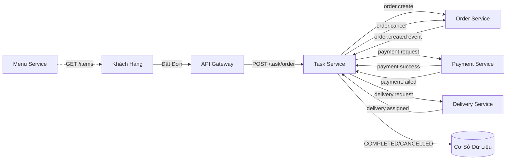

### 1.2 Existing Automation Systems

List existing systems, databases, or legacy logic related to this process.

| System Name | Type          | Current Role  | Interaction Method |
| ----------- | ------------- | ------------- | ------------------ |
| Không có    | Không áp dụng | Không áp dụng | Không áp dụng      |

> Không có — quy trình này hiện được thực hiện hoàn toàn thủ công qua email, điện thoại và quản lý trực tiếp trên giấy. Đây là dự án xây dựng từ đầu (greenfield).

### 1.3 Non-Functional Requirements

Non-functional requirements serve as input for identifying Utility Service and Microservice Candidates in step 2.7.

| Requirement  | Description                                                                                                                                         |
| ------------ | --------------------------------------------------------------------------------------------------------------------------------------------------- |
| Performance  | Thời gian phản hồi dưới 2 giây cho yêu cầu đặt đơn; xử lý thanh toán dưới 5 giây                                                                    |
| Security     | Xác thực qua JWT token; mã hóa dữ liệu nhạy cảm; kiểm soát truy cập dựa trên vai trò (RBAC) trong Phase 2                                           |
| Scalability  | Hỗ trợ mở rộng ngang (horizontal scaling) thông qua Docker/Kubernetes; xử lý tăng 10x lưu lượng truy cập trong giờ cao điểm mà không giảm hiệu năng |
| Availability | SLA thời gian hoạt động 99.5%; suy giảm dịu dàng khi các dịch vụ gặp sự cố; hủy đơn hàng vẫn khả dụng khi Order Service gặp sự cố                   |

---

## Part 2 — REST/Microservices Modeling

### 2.1 Decompose Business Process & 2.2 Filter Unsuitable Actions

Decompose the process from 1.1 into granular actions. Mark actions unsuitable for service encapsulation.

| #   | Action                               | Actor                        | Description                                                          | Suitable? |
| --- | ------------------------------------ | ---------------------------- | -------------------------------------------------------------------- | --------- |
| 1   | Nhận yêu cầu đặt đơn                 | API Gateway                  | Tiếp nhận yêu cầu HTTP từ khách hàng                                 | ✅        |
| 2   | Xác thực dữ liệu đơn hàng            | Task Service                 | Kiểm tra các trường bắt buộc (số tiền, điện thoại, địa chỉ, ID menu) | ✅        |
| 3   | Tạo bản ghi đơn hàng                 | Order Service                | Lưu trữ đơn hàng với trạng thái PENDING                              | ✅        |
| 4   | Phát hành sự kiện order.created      | Order Service                | Thông báo không đồng bộ tới công cụ điều phối                        | ✅        |
| 5   | Yêu cầu thanh toán                   | Payment Service              | Kiểm tra ID đơn hàng có tồn tại, số tiền > 0                         | ✅        |
| 6   | Xử lý thanh toán                     | Payment Service              | Mô phỏng kết quả thanh toán (thành công/thất bại 50%)                | ✅        |
| 7   | Phát hành kết quả thanh toán         | Payment Service              | Gửi sự kiện payment.success hoặc payment.failed                      | ✅        |
| 8   | Cập nhật trạng thái đơn hàng         | Task Service / Order Service | Chuyển tiếp trạng thái trong công cụ điều phối                       | ✅        |
| 9   | Tạo yêu cầu giao hàng                | Delivery Service             | Phân công shipper, tạo ID giao hàng                                  | ✅        |
| 10  | Phát hành sự kiện delivery.assigned  | Delivery Service             | Thông báo hoàn tất đơn hàng                                          | ✅        |
| 11  | Hủy đơn hàng khi thanh toán thất bại | Order Service                | Rollback trạng thái đơn hàng về CANCELLED                            | ✅        |
| 12  | Theo dõi shipper realtime            | Delivery Service             | Cập nhật vị trí shipper theo thời gian thực (ngoài phạm vi)          | ❌        |
| 13  | Đánh giá rủi ro thủ công             | Người Vận Hành Hệ Thống      | Kiểm tra gian lận thủ công (ngoài phạm vi)                           | ❌        |

> Actions marked ❌: manual-only, require human judgment, or cannot be encapsulated as a service.

### 2.3 Entity Service Candidates

Identify business entities and group reusable (agnostic) actions into Entity Service Candidates.

| Entity               | Service Candidate | Agnostic Actions                                                   |
| -------------------- | ----------------- | ------------------------------------------------------------------ |
| Đơn Hàng (Order)     | Order Service     | Tạo đơn hàng, cập nhật trạng thái, hủy đơn hàng, phát hành sự kiện |
| Thanh Toán (Payment) | Payment Service   | Xác thực yêu cầu thanh toán, xử lý thanh toán, phát hành kết quả   |
| Giao Hàng (Delivery) | Delivery Service  | Tạo yêu cầu giao hàng, phân công shipper, cập nhật trạng thái      |
| Menu (Menu Catalog)  | Menu Service      | Liệt kê các mục menu, trả về danh sách hàng hóa                    |

### 2.4 Task Service Candidate

Group process-specific (non-agnostic) actions into a Task Service Candidate.

| Non-agnostic Action                                                                                  | Task Service Candidate           |
| ---------------------------------------------------------------------------------------------------- | -------------------------------- |
| Điều phối quy trình đặt đơn → thanh toán → giao hàng                                                 | Task Service (Saga Orchestrator) |
| Định tuyến sự kiện order.created sang lệnh payment.request                                           | Công Cụ Điều Phối                |
| Định tuyến payment.success sang lệnh delivery.request                                                | Công Cụ Điều Phối                |
| Định tuyến payment.failed sang lệnh order.cancel                                                     | Công Cụ Điều Phối                |
| Theo dõi trạng thái saga (ORDER_CREATED, PAYMENT_PROCESSING, DELIVERY_ASSIGNED, COMPLETED/CANCELLED) | Công Cụ Điều Phối                |

### 2.5 Identify Resources

Map entities/processes to REST URI Resources.

| Entity / Process        | Resource URI                                                                     |
| ----------------------- | -------------------------------------------------------------------------------- |
| Tạo đơn hàng            | POST /task/order                                                                 |
| Xem trạng thái hệ thống | GET /task/health, /order/health, /payment/health, /delivery/health, /menu/health |
| Liệt kê menu            | GET /menu/items                                                                  |
| Xác thực dịch vụ        | GET /\*/health                                                                   |

### 2.6 Associate Capabilities with Resources and Methods

| Service Candidate | Capability                                           | Resource         | HTTP Method |
| ----------------- | ---------------------------------------------------- | ---------------- | ----------- |
| Task Service      | Đặt đơn hàng                                         | /task/order      | POST        |
| Task Service      | Kiểm tra sức khỏe                                    | /task/health     | GET         |
| Order Service     | Kiểm tra sức khỏe                                    | /order/health    | GET         |
| Order Service     | Tạo đơn hàng (nội bộ, không đồng bộ)                 | —                | —           |
| Order Service     | Cập nhật trạng thái đơn hàng (nội bộ, không đồng bộ) | —                | —           |
| Payment Service   | Kiểm tra sức khỏe                                    | /payment/health  | GET         |
| Payment Service   | Xử lý thanh toán (nội bộ, không đồng bộ)             | —                | —           |
| Delivery Service  | Kiểm tra sức khỏe                                    | /delivery/health | GET         |
| Delivery Service  | Phân công giao hàng (nội bộ, không đồng bộ)          | —                | —           |
| Menu Service      | Liệt kê các mục menu                                 | /menu/items      | GET         |
| Menu Service      | Kiểm tra sức khỏe                                    | /menu/health     | GET         |

### 2.7 Utility Service & Microservice Candidates

Based on Non-Functional Requirements (1.3) and Processing Requirements, identify cross-cutting utility logic or logic requiring high autonomy/performance.

| Candidate                   | Type (Utility / Microservice) | Justification                                                                                      |
| --------------------------- | ----------------------------- | -------------------------------------------------------------------------------------------------- |
| API Gateway                 | Utility                       | Cắt ngang các service; load balancing; thực thi xác thực; điểm giới hạn tốc độ; định tuyến yêu cầu |
| Service Discovery (Eureka)  | Utility                       | Đăng ký và khám phá dịch vụ; khả dụng cao; khả năng phục hồi                                       |
| RabbitMQ (Message Broker)   | Utility                       | Giao tiếp không đồng bộ cho saga; tách rời; khả năng phát lại sự kiện                              |
| Menu Service                | Microservice                  | Danh sách độc lập; có thể mở rộng riêng biệt; có thể tái sử dụng cho các tính năng khác            |
| Order Service               | Microservice                  | Thực thể cốt lõi; quyền tự định cao trên dữ liệu đơn hàng; đường dẫn quan trọng                    |
| Payment Service             | Microservice                  | Nhạy cảm với lỗi; yêu cầu cách ly; khả năng tích hợp với cổng thanh toán bên thứ ba                |
| Delivery Service            | Microservice                  | Khả năng tích hợp với API vận chuyển; theo dõi shipper độc lập                                     |
| Task Service (Orchestrator) | Microservice                  | Máy trạng thái saga; điều phối logic kinh doanh; không có tính bền vững dữ liệu (stateless)        |

### 2.8 Service Composition Candidates

Interaction diagram showing how Service Candidates collaborate to fulfill the business process.

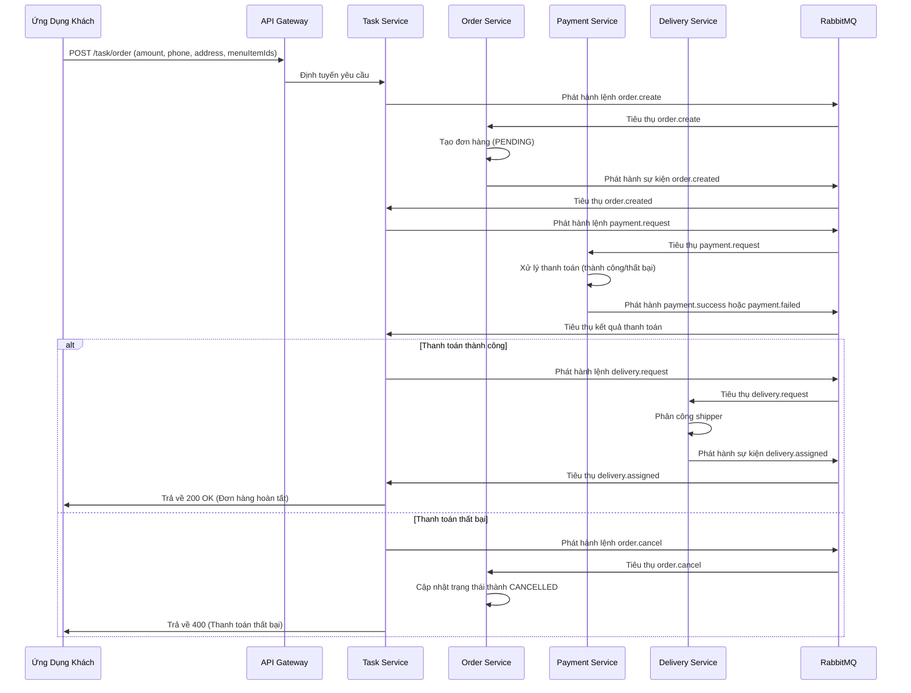

---

## Part 3 — Service-Oriented Design

### 3.1 Uniform Contract Design

Service Contract specification for each service. Full OpenAPI specs available at:

- [docs/api-specs/TaskService.yaml](docs/api-specs/TaskService.yaml)
- [docs/api-specs/OrderService.yaml](docs/api-specs/OrderService.yaml)
- [docs/api-specs/PaymentService.yaml](docs/api-specs/PaymentService.yaml)
- [docs/api-specs/DeliveryService.yaml](docs/api-specs/DeliveryService.yaml)
- [docs/api-specs/MenuService.yaml](docs/api-specs/MenuService.yaml)

**Task Service (Công Cụ Điều Phối Saga):**

| Endpoint     | Method | Media Type       | Response Codes                                     |
| ------------ | ------ | ---------------- | -------------------------------------------------- |
| /task/health | GET    | text/plain       | 200 OK                                             |
| /task/order  | POST   | application/json | 200 OK, 400 Bad Request, 500 Internal Server Error |

**Order Service:**

| Endpoint      | Method | Media Type | Response Codes |
| ------------- | ------ | ---------- | -------------- |
| /order/health | GET    | text/plain | 200 OK         |

**Payment Service:**

| Endpoint        | Method | Media Type | Response Codes |
| --------------- | ------ | ---------- | -------------- |
| /payment/health | GET    | text/plain | 200 OK         |

**Delivery Service:**

| Endpoint         | Method | Media Type | Response Codes |
| ---------------- | ------ | ---------- | -------------- |
| /delivery/health | GET    | text/plain | 200 OK         |

**Menu Service:**

| Endpoint     | Method | Media Type       | Response Codes      |
| ------------ | ------ | ---------------- | ------------------- |
| /menu/health | GET    | text/plain       | 200 OK              |
| /menu/items  | GET    | application/json | 200 OK (MenuItem[]) |

### 3.2 Service Logic Design

Internal processing flow for each service.

**Task Service (Công Cụ Điều Phối):**

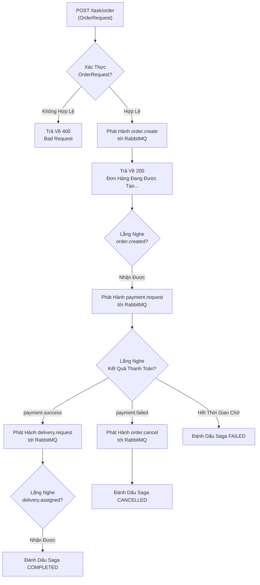

**Order Service:**

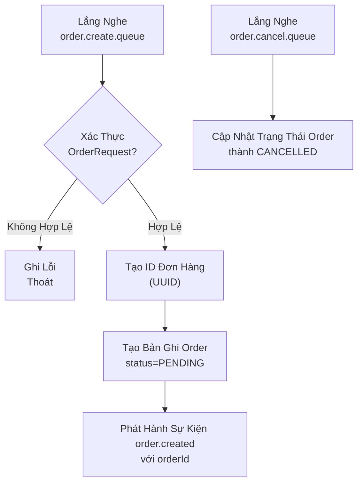

**Payment Service:**

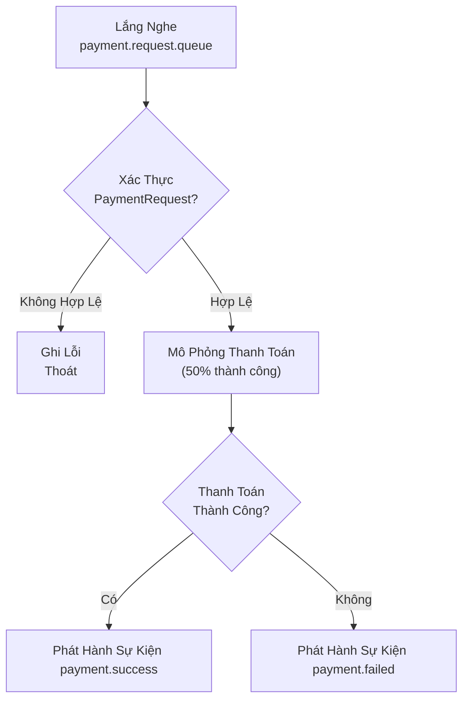

**Delivery Service:**

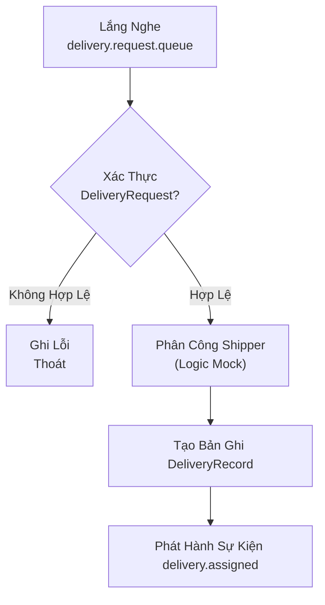

**Menu Service:**

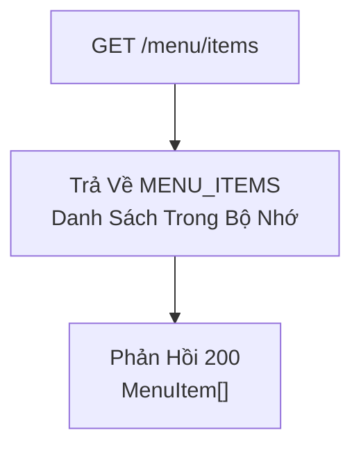

---

**Last Updated**: April 2026

---

## Part 1 — Analysis Preparation

### 1.1 Business Process Definition

Describe or diagram the high-level Business Process to be automated.

- **Domain**: Hệ thống quản lý đơn hàng cho nhà hàng đơn (Single Restaurant Order Management System)
- **Business Process**: Khách hàng đặt đơn → Thanh toán → Giao hàng → Hoàn tất
- **Actors**:
  - Customer (Khách hàng): Đặt đơn và nhận hàng giao
  - System (Hệ thống): Xử lý đơn qua orchestrator
  - Payment Service (Dịch vụ Thanh toán): Xử lý giao dịch thanh toán
  - Delivery Service (Dịch vụ Giao hàng): Quản lý phân công shipper và logistics giao hàng
- **Scope**: Quản lý đơn hàng từ đầu đến cuối cho một nhà hàng; không bao gồm quản lý menu phức tạp, tích hợp thanh toán thực, và theo dõi shipper real-time

**Process Diagram:**

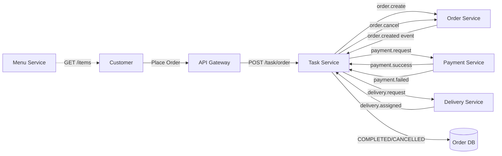

### 1.2 Existing Automation Systems

**Không có** — Đây là dự án greenfield (xây dựng từ đầu). Quy trình đặt đơn của nhà hàng đơn trước đây được thực hiện thủ công qua:

- Nhận đơn qua email hoặc điện thoại
- Xác minh thanh toán thủ công
- Phối hợp shipper thủ công

Không có hệ thống legacy nào để tích hợp trong Phase 1.

### 1.3 Non-Functional Requirements

Non-functional requirements serve as input for identifying Utility Service and Microservice Candidates in step 2.7.

| Requirement | Description |
| 1 | Validate order input | System | Check required fields (amount, phone, address, menuItemIds) | ✅ |
| 2 | Create order record | Order Service | Persist order with PENDING status | ✅ |
| 3 | Publish order.created event | Order Service | Async notification to orchestrator | ✅ |
| 4 | Validate payment request | Payment Service | Check order ID exists, amount > 0 | ✅ |
| 5 | Process payment | Payment Service | Simulate payment outcome (success/fail 50%) | ✅ |
| 6 | Publish payment result event | Payment Service | Send payment.success or payment.failed | ✅ |
| 7 | Update order status (PAID/FAILED) | Task Service / Order Service | State transition in orchestrator | ✅ |
| 8 | Create delivery request | Delivery Service | Assign shipper, generate delivery ID | ✅ |
| 9 | Publish delivery.assigned event | Delivery Service | Notify order completion | ✅ |
| 10 | Cancel order on payment failure | Order Service | Rollback order to CANCELLED status | ✅ |
| 11 | Communicate with shipper | Delivery Service | Real-time shipper updates (out of scope) | ❌ |
| 12 | Human risk assessment | System Operator | Manual fraud check (out of scope) | ❌ |

> Actions marked ❌ are excluded from Phase 1 scop endpoints; JWT token support for future frontend |
> | Scalability | Horizontal scaling via Docker/Kubernetes; support for 10x traffic spike during peak hours without service degradation |
> | Availability | 99.5% uptime SLA; graceful degradation when services are down (e.g., order cancellation remains possible); health check endpoints on all services |
> | Reliability | No lost orders; saga pattern ensures atomicity (all-or-nothing) for distributed transactions; rollback on payment failure |
> | Auditability | All order state transitions logged; event-driven architecture enables audit trail reconstruction |

---

## Part 2 — REST/Microservices Modeling

### 2.1 Decompose Business Process & 2.2 Filter Unsuitable Actions

Decompose the process from 1.1 into granular actions. Mark actions unsuitable for service encapsulation.

| # | Action | Actor | Description | Suitable? |
| Order | Order Service | Create order (#2), Validate order input (#1), Update order status (#7), Publish order.created (#3), Cancel order (#10) |
| Payment | Payment Service | Validate payment request (#4), Process payment (#5), Publish payment result (#6) |
| Delivery | Delivery Service | Create delivery request (#8), Assign shipper (implicit), Publish delivery.assigned (#9) |
| Menu | Menu Service | List menu items (agnostic catalog; reusable for future features like "popular items", "recommendations")- |
| | | | | ✅ / ❌ |

> Actions marked ❌: manual-only, require human judgment, or cannot be encapsulated as a service.
> (Orchestrator).

| Non-agnostic Action                                                                                  | Task Service Candidate                                                   |
| ---------------------------------------------------------------------------------------------------- | ------------------------------------------------------------------------ | ---------------- |
| Điều phối qi trình đặt đơn → thanh toán → giao hàng                                                  | Task Service (Saga Orchestrator)                                         |
| Định tuyến sự kiện order.created sang lệnh payment.request                                           | Orchestrator                                                             |
| Định tuyến payment.success sang lệnh delivery.request                                                | Orchestrator                                                             |
| Định tuyến payment.failed sang lệnh order.cancel                                                     | Orchestrator                                                             |
| Theo dõi trạng thái saga (ORDER_CREATED, PAYMENT_PROCESSING, DELIVERY_ASSIGNED, COMPLETED/CANCELLED) | Orchestrator                                                             |
| Order                                                                                                | /order/health                                                            |
| Payment                                                                                              | /payment/health                                                          |
| Delivery                                                                                             | /delivery/health                                                         |
| Task / Orchestration                                                                                 | /task/order (POST), /task/health (GET)                                   |
| Menu Catalog                                                                                         | /menu/items (GET), /menu/health (GET)                                    |
| Gateway Proxy                                                                                        | /order/**, /payment/**, /delivery/**, /task/**, /menu/\*\*nostic Actions |
| ------                                                                                               | -----------------                                                        | ---------------- |
|                                                                                                      |                                                                          |                  |

### 2.4 Task Service Candidate

GrTask Service | Place order | /task/order | POST |
| Task Service | Health check | /task/health | GET |
| Order Service | Health check | /order/health | GET |
| Order Service | Create order (internal, async via RabbitMQ) | — | — |
| Order Service | Update order status (internal, async via RabbitMQ) | — | — |
| Payment Service | Health check | /payment/health | GET |
| Payment Service | Process payment (internal, async via RabbitMQ) | — | — |
| Delivery Service | Health check | /delivery/health | GET |
| Delivery Service | Assign delivery (internal, async via RabbitMQ) | — | — |
| Menu Service | List menu items | /menu/items | GET |
| Menu Service | Health check | /menu/health | GET Service Candidate.

| Non-agnostic Action         | Task Service Candidate |
| --------------------------- | ---------------------- | ----------------------------------------------------------------------------------------------- |
| Gateway                     | Utility                | Cross-cutting service mesh; load balancing; auth enforcement; rate limiting point               |
| Service Discovery           | Utility                | Eureka for service registration and client-side discovery; HA and resilience                    |
| RabbitMQ (Message Broker)   | Utility                | Async communication for saga choreography; decoupling; replay capability                        |
| Menu Service                | Microservice           | Independent catalog; can be scaled separately; reusable for recommendations/filters             |
| Order Service               | Microservice           | Core entity; high autonomy over order data; critical path                                       |
| Payment Service             | Microservice           | Sensitive to failure; requires isolation; potential integration with 3rd-party payment gateways |
| Delivery Service            | Microservice           | Potential integration with logistics APIs; independent shipper tracking                         |
| Task Service (Orchestrator) | Microservice           | Saga state machine; business logic coordination; no data persistence (stateless)                |

### 2.5 Identify Resources

Map entities/processes to REST URI Resources. (Saga Orchestration Pattern).

**Success Flow:**

````mermaid
sequenceDiagram
    participant Client
    participant Gateway as API Gateway
    participant Task as Task Service
    participant Order as Order Service
    participant Payment as Payment Service
    participant Delivery as Delivery Service
    participant RabbitMQ

    Client->>Gateway: POST /task/order (amount, phone, address, menuItemIds)
    Gateway->>Task: Forward request
    Task->>RabbitMQ: Publish order.create command
    RabbitMQ->>Order: Consume order.create
    Order->>Order: Create order (PENDING)
    Order->>RabbitMQ: Publish order.created event
    RabbitMQ->>Task: Consume order.created
    Task->>RabbitMQ: Publish payment.request command available in:

- [docs/api-specs/TaskService.yaml](api-specs/TaskService.yaml)
- [docs/api-specs/OrderService.yaml](api-specs/OrderService.yaml)
- [docs/api-specs/PaymentService.yaml](api-specs/PaymentService.yaml)
- [docs/api-specs/DeliveryService.yaml](api-specs/DeliveryService.yaml)
- [docs/api-specs/MenuService.yaml](api-specs/MenuService.yaml)

**Task Service:**

| Endpoint | Method | Media Type | Request Body | Response Codes |
| -------- | ------ | ---------- | ------------ | -------------- |
| /task/health | GET | text/plain | — | 200 OK |
| /task/order | POST | application/json | OrderRequest | 200 OK, 400 Bad Request |

**Order Service:**

| Endpoint | Method | Media Type | Response Codes |
| -------- | ------ | ---------- | -------------- |
| /order/health | GET | text/plain | 200 OK |

**Payment Service:**

| Endpoint | Method | Media Type | Response Codes |
| -------- | ------ | ---------- | -------------- |
| /payment/health | GET | text/plain | 200 OK |

**Delivery Service:**

| Endpoint | Method | Media Type | Response Codes |
| -------- | ------ | ---------- | -------------- |
| /delivery/health | GET | text/plain | 200 OK |

**Menu Service:**

| Endpoint | Method | Media Type | Response Codes |
| -------- | ------ | ---------- | -------------- |
| /menu/health | GET | text/plain | 200 OK |
| /menu/items | GET | application/json | 200 OK (MenuItem[])

```mermaid
sequenceDiagram
    participant Payment as Payment Service
    participant Task as Task Service
  Task Service (Orchestrator):**

```mermaid
flowchart TD
    A["POST /task/order<br/>(OrderRequest)"] --> B{Validate<br/>OrderRequest?}
    B -->|Invalid| C["Return 400<br/>Bad Request"]
    B -->|Valid| D["Publish order.create<br/>to RabbitMQ"]
    D --> E["Return 200<br/>Order creating..."]
    E --> F{Listen for<br/>order.created}
    F -->|Received| G["Publish payment.request<br/>to RabbitMQ"]
    G --> H{Listen for<br/>payment result}
    H -->|payment.success| I["Publish delivery.request<br/>to RabbitMQ"]
    H -->|payment.failed| J["Publish order.cancel<br/>to RabbitMQ"]
    H -->|timeout| K["Mark saga FAILED"]
    I --> L{Listen for<br/>delivery.assigned}
    L -->|Received| M["Mark saga COMPLETED"]
    J --> N["Mark saga CANCELLED"]
````

**Order Service:**

```mermaid
flowchart TD
    A["Listen on<br/>order.create.queue"] --> B{Validate<br/>OrderRequest?}
    B -->|Invalid| C["Log Error<br/>Exit"]
    B -->|Valid| D["Generate orderId<br/>(UUID)"]
    D --> E["Create Order record<br/>status=PENDING"]
    E --> F["Publish order.created event<br/>with orderId"]
    G["Listen on<br/>order.cancel.queue"] --> H["Update Order status<br/>to CANCELLED"]
```

**Payment Service:**

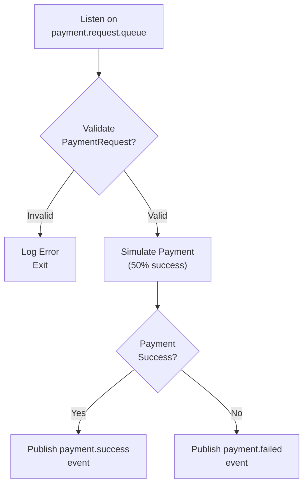

**Delivery Service:**

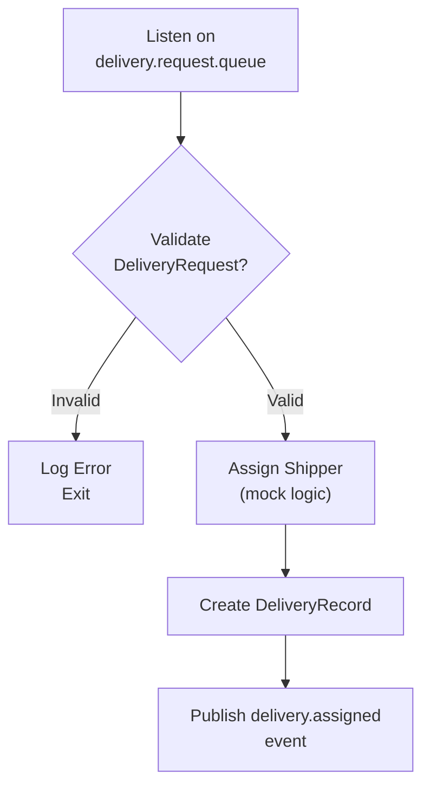

---

## Part 4 — System Architecture

### 4.1 System Architecture Overview

The system implements a **distributed microservices architecture** using the **Saga Orchestration pattern** for distributed transaction management across 5 independent services:

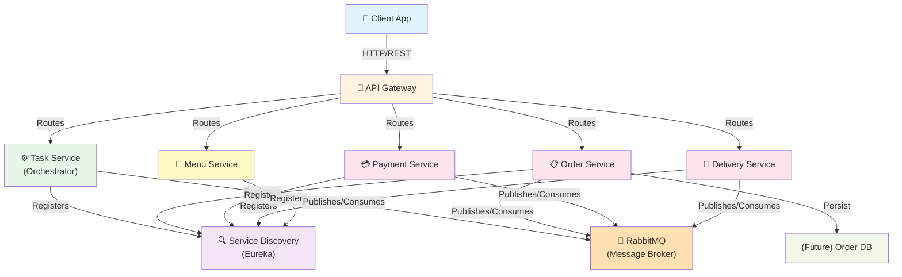

### 4.2 Technology Stack

| Component               | Technology                                   | Version              | Rationale                                                          |
| ----------------------- | -------------------------------------------- | -------------------- | ------------------------------------------------------------------ |
| **Language**            | Java                                         | 17+                  | Type-safe, strong ecosystem, mature frameworks                     |
| **Web Framework**       | Spring Boot                                  | 3.4.2                | Best-in-class REST support, auto-config, production-ready          |
| **Microservices Cloud** | Spring Cloud                                 | 2024.0.1             | Gateway, Eureka, circuit breaker, distributed tracing              |
| **Message Broker**      | RabbitMQ                                     | -                    | Supports topic-based pub/sub for saga choreography; durable queues |
| **Service Registry**    | Eureka                                       | Netflix Spring Cloud | Client-side discovery; health checks; load balancing               |
| **API Gateway**         | Spring Cloud Gateway                         | -                    | Route requests; auth enforcement; rate limiting                    |
| **Container Runtime**   | Docker                                       | -                    | Consistent deployment across dev/staging/prod                      |
| **Orchestration**       | docker-compose (local) / Kubernetes (future) | -                    | Local development and testing                                      |
| **Logging**             | System.out (Phase 1)                         | -                    | Simple logging; upgrade to ELK Stack in Phase 2                    |
| **Build**               | Maven                                        | 3.9                  | Dependency management; plugin ecosystem                            |

### 4.3 Deployment Architecture

**Phase 1 (Current): Docker Compose - Local Development**

```yaml
services:
  service-discovery: # Eureka (port 8761)
  order-service: # (port 8081)
  payment-service: # (port 8082)
  delivery-service: # (port 8083)
  task-service: # (port 8084)
  menu-service: # (port 8085)
  gateway: # (port 8080)
  rabbitmq: # (port 5672, mgmt 15672)
```

**Phase 2 (Future): Kubernetes - Production**

```
- StatefulSet for RabbitMQ (persistent storage)
- Deployments for each microservice with replicas (3+)
- Service resources for internal discovery
- Ingress for external traffic routing
- ConfigMap for environment-specific configs
- Secrets for credentials (API keys, DB passwords)
- PVC for Order Service database storage
```

### 4.4 Data Persistence Strategy

| Service              | Data Persistence  | Rationale                              | Storage (Phase 1)            |
| -------------------- | ----------------- | -------------------------------------- | ---------------------------- |
| **Task Service**     | Stateless         | Saga state derived from event sequence | In-memory (no state)         |
| **Order Service**    | Eventual (Future) | Order records + status history         | TODO: Add DB (PostgreSQL)    |
| **Payment Service**  | Stateless         | Payment records persisted via events   | In-memory (mock)             |
| **Delivery Service** | Stateless         | Delivery records persisted via events  | In-memory (mock)             |
| **Menu Service**     | In-memory         | Read-only catalog; no write operations | Static list (no persistence) |

**Event Sourcing (Future Phase 3):**

- All order events (created, payment_success, delivery_assigned) persisted to event store
- Complete audit trail reconstructable from event log
- Enables temporal queries ("what was order status at time T?")

### 4.5 Saga Pattern Implementation: Orchestration

**Choreography vs. Orchestration Decision:**

- **Selected**: Orchestration (via Task Service)
- **Rationale**: Centralized saga state visibility; clear flow definition; easier debugging

**Saga State Transitions:**

```
START
  ↓
Order Service: ORDER_CREATED
  ↓
Task Service → Payment.request
  ↓
Payment Service: PAYMENT_PROCESSING
  ↓
├─→ payment.success → Delivery.request → DELIVERY_ASSIGNED → ✅ COMPLETED
└─→ payment.failed → Order.cancel → ❌ CANCELLED
```

**Rollback Strategy:**

1. **Automatic Rollback**: On payment failure, Task Service publishes order.cancel command
2. **Compensating Transactions**: Order Service handles cancel by updating order status to CANCELLED
3. **Idempotency**: All operations (create, cancel) include orderId; duplicates are silently ignored
4. **Message Replay**: RabbitMQ persistent queues prevent message loss; failed services can replay messages on recovery

### 4.6 Error Handling & Resiliency

| Failure Scenario                         | Mitigation Strategy                                                                                           |
| ---------------------------------------- | ------------------------------------------------------------------------------------------------------------- |
| Service Unavailable (Order Service down) | Message queues buffer commands; service recovers and processes queued messages (eventual consistency)         |
| Payment Service slow                     | Consumer (Task Service) uses timeout; if no response within 5s, consider payment failed and initiate rollback |
| RabbitMQ Crash                           | Persistent queues (durable=true) recover messages from disk; messages not lost                                |
| Network Partition                        | Saga can complete asynchronously; eventual consistency model tolerates delays                                 |
| Duplicate Messages                       | All handlers check message idempotency (e.g., orderId already exists → skip)                                  |
| Task Service Restart                     | Saga state reconstruction from event log (future: event sourcing); in-memory state lost (Phase 1 limitation)  |

**Health Checks & Monitoring (Phase 2):**

- `/health` endpoint on each service
- Eureka dashboard for registered services
- RabbitMQ Management UI for queue depth monitoring
- Spring Boot Actuator for metrics (CPU, memory, request count)

### 4.7 Message Flow & Event Model

**Topics/Exchanges & Routing Keys** (RabbitMQ TopicExchange):

| Exchange       | Routing Key       | Queue                   | Consumer         |
| -------------- | ----------------- | ----------------------- | ---------------- |
| order.exchange | order.create      | order.create.queue      | Order Service    |
| order.exchange | order.created     | order.created.queue     | Task Service     |
| order.exchange | order.cancel      | order.cancel.queue      | Order Service    |
| order.exchange | payment.request   | payment.request.queue   | Payment Service  |
| order.exchange | payment.success   | payment.success.queue   | Task Service     |
| order.exchange | payment.failed    | payment.failed.queue    | Task Service     |
| order.exchange | delivery.request  | delivery.request.queue  | Delivery Service |
| order.exchange | delivery.assigned | delivery.assigned.queue | Task Service     |

**Message Schema (JSON):**

```json
// OrderRequest (Task Service → Order Service)
{
  "amount": 120000.0,
  "phone": "0987654321",
  "address": "123 Đường ABC, Hà Nội",
  "description": "Cơm gà và trà đào",
  "menuItemIds": ["M01", "M04"]
}

// OrderCreatedEvent (Order Service → Task Service)
{
  "orderId": "f47ac10b-58cc-4372-a567-0e02b2c3d479",
  "amount": 120000.0
}

// PaymentRequest (Task Service → Payment Service)
{
  "orderId": "f47ac10b-58cc-4372-a567-0e02b2c3d479",
  "amount": 120000.0
}

// PaymentSuccessEvent / PaymentFailedEvent
{
  "orderId": "f47ac10b-58cc-4372-a567-0e02b2c3d479"
}

// DeliveryRequest (Task Service → Delivery Service)
{
  "orderId": "f47ac10b-58cc-4372-a567-0e02b2c3d479"
}

// DeliveryAssignedEvent (Delivery Service → Task Service)
{
  "orderId": "f47ac10b-58cc-4372-a567-0e02b2c3d479"
}
```

### 4.8 Security & Authentication (Phase 2)

**Current (Phase 1):** No security enforcement; Eureka/RabbitMQ use default credentials (guest/guest).

**Future Enhancements:**

| Layer                  | Implementation                                                              |
| ---------------------- | --------------------------------------------------------------------------- |
| **API Gateway**        | OAuth 2.0 / JWT token validation before routing to services                 |
| **Inter-service**      | mTLS (mutual TLS) for service-to-service gRPC calls (if upgraded from REST) |
| **Message Broker**     | RabbitMQ username/password; encrypted credentials in K8s Secrets            |
| **Data in Transit**    | HTTPS/TLS for all external API calls                                        |
| **Secrets Management** | HashiCorp Vault or cloud provider (AWS Secrets Manager, Azure Key Vault)    |

### 4.9 Scalability & Performance Considerations

| Concern               | Current                                 | Future                                                                                  |
| --------------------- | --------------------------------------- | --------------------------------------------------------------------------------------- |
| **Concurrency**       | Single instance per service             | Horizontally scale with Kubernetes StatefulSet; K8s HPA auto-scales based on CPU/Memory |
| **Load Balancing**    | Spring Cloud LoadBalancer (client-side) | Kubernetes Service (round-robin); consider Istio for advanced traffic policies          |
| **Caching**           | None (Phase 1)                          | Redis for Menu Service (read-heavy); Cache-Aside pattern                                |
| **Database**          | Stateless (Phase 1)                     | PostgreSQL with read replicas for Order Service; partition by date for large volumes    |
| **Message Queue**     | Single RabbitMQ instance                | RabbitMQ cluster (3+ nodes); durable settings for HA                                    |
| **API Rate Limiting** | None                                    | Spring Cloud Gateway rate limiter; token bucket algorithm                               |

### 4.10 Monitoring & Observability (Phase 2)

**Logging:**

- Spring Boot Actuator for request/response logging
- Upgrade to ELK Stack (Elasticsearch, Logstash, Kibana) for centralized log aggregation

**Tracing:**

- Spring Cloud Sleuth + Zipkin for distributed request tracing
- Track request flow across services (Order → Payment → Delivery)

**Metrics:**

- Micrometer for metrics collection
- Prometheus for scraping metrics
- Grafana for visualization (dashboards for order throughput, payment success rate, delivery latency)

**Alerting:**

- Alert Manager for notification rules (email, Slack on high failure rates)

---

## Part 5 — Future Enhancements (Phase 2+)

### Short-term (1-2 sprints)

1. Add Order Service database (PostgreSQL) for persistence
2. Implement JWT authentication in Gateway
3. Upgrade logging to ELK Stack
4. Add Swagger UI for live API documentation
5. Write integration tests for saga choreography
6. Implement circuit breaker pattern (Resilience4j) for cross-service calls

### Mid-term (2-4 sprints)

1. Event sourcing: persist all saga events to audit store
2. CQRS pattern: separate read model (reporting) from write model (order processing)
3. Add real payment gateway integration (Stripe, PayPal)
4. Implement shipper tracking and real-time delivery status updates
5. Multi-restaurant support with tenant isolation
6. Deploy to Kubernetes with Helm charts

### Long-term (5+ sprints)

1. GraphQL API layer for flexible client queries
2. Async order status notifications (WebSocket, Server-Sent Events)
3. Machine learning for demand forecasting and inventory optimization
4. Mobile app (iOS/Android) with push notifications
5. Analytics dashboard for restaurant owner (peak hours, popular items, revenue trends)
6. Subscription/loyalty program integration

**Menu Service:**

````mermaid
flowchart TD
    A["GET /menu/items"] --> B["Return MENU_ITEMS<br/>in-memory list"]
    B --> C["Response 200<br/>MenuItem[]"
```mermaid
sequenceDiagram
    participant Client
    participant TaskService
    participant EntityServiceA
    participant EntityServiceB
    participant UtilityService

    Client->>TaskService: (fill in)
    TaskService->>EntityServiceA: (fill in)
    EntityServiceA-->>TaskService: (fill in)
    TaskService->>EntityServiceB: (fill in)
    EntityServiceB-->>TaskService: (fill in)
    TaskService-->>Client: (fill in)
````

---

## Part 3 — Service-Oriented Design

### 3.1 Uniform Contract Design

Service Contract specification for each service. Full OpenAPI specs:

- [`docs/api-specs/service-a.yaml`](api-specs/service-a.yaml)
- [`docs/api-specs/service-b.yaml`](api-specs/service-b.yaml)

**Service A:**

| Endpoint | Method | Media Type | Response Codes |
| -------- | ------ | ---------- | -------------- |
|          |        |            |                |

**Service B:**

| Endpoint | Method | Media Type | Response Codes |
| -------- | ------ | ---------- | -------------- |
|          |        |            |                |

### 3.2 Service Logic Design

Internal processing flow for each service.

**Service A:**

```mermaid
flowchart TD
    A[Receive Request] --> B{Validate?}
    B -->|Valid| C[(Process / DB)]
    B -->|Invalid| D[Return 4xx Error]
    C --> E[Return Response]
```

**Service B:**

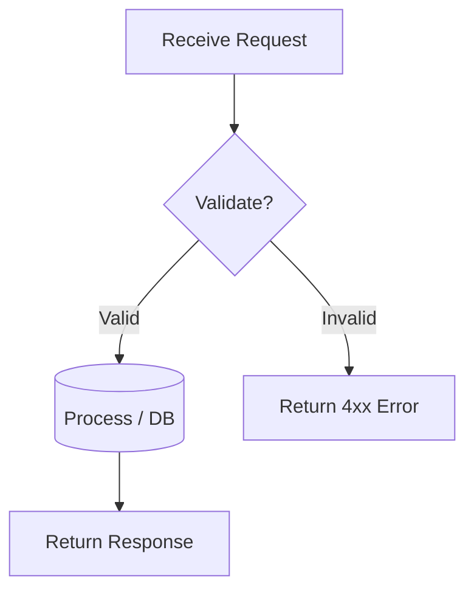
