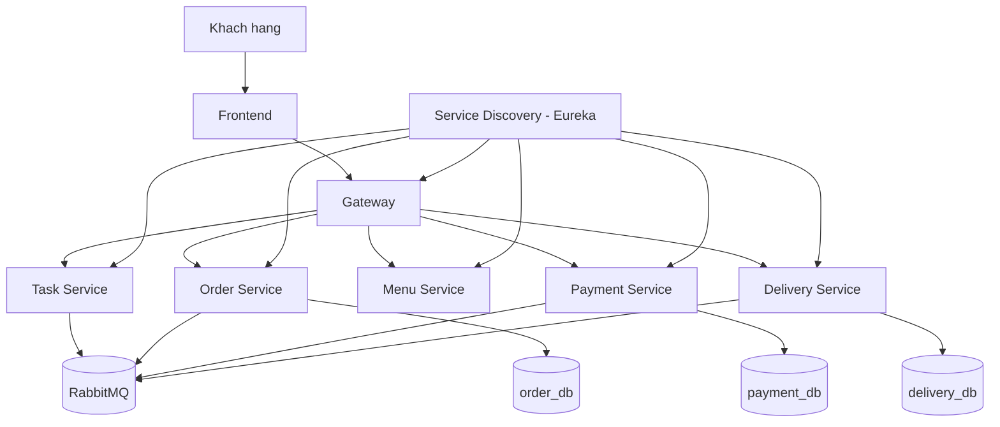

# 🏗️ System Architecture

## 1. Overview

Hệ thống được xây dựng để tự động hóa quy trình đặt món cho mô hình nhà hàng đơn theo hướng dịch vụ (SOA/Microservices).

- Bài toán giải quyết: đồng bộ luồng đặt đơn, thanh toán, giao hàng theo cơ chế bất đồng bộ; hạn chế phụ thuộc giữa các dịch vụ; dễ mở rộng từng thành phần độc lập.
- Người dùng mục tiêu: khách hàng đặt món qua giao diện web và nhóm vận hành kỹ thuật quản trị hệ thống dịch vụ.
- Thuộc tính chất lượng chính:
  - Khả năng mở rộng: mở rộng ngang theo từng service.
  - Độ tin cậy: dùng Saga Orchestration để xử lý giao dịch phân tán, có luồng bù trừ khi lỗi.
  - Tính sẵn sàng: mỗi service có health check, chạy độc lập qua Docker Compose.
  - Khả năng bảo trì: tách domain rõ ràng (Order, Payment, Delivery, Menu, Task).

## 2. Architecture Style

Describe the architectural patterns and styles used:

- [x] Microservices
- [x] API Gateway pattern
- [x] Event-driven / Message queue
- [ ] CQRS / Event Sourcing
- [x] Database per service
- [x] Saga pattern
- [x] Other: Service Discovery (Eureka)

## 3. System Components

| Component             | Responsibility                                                              | Tech Stack                    | Port               |
| --------------------- | --------------------------------------------------------------------------- | ----------------------------- | ------------------ |
| **Frontend**          | Giao diện đặt món, chọn món, gửi yêu cầu đặt đơn, polling trạng thái đơn    | HTML/CSS/JavaScript + Nginx   | 3000               |
| **Gateway**           | Định tuyến API vào các service backend theo path                            | Spring Cloud Gateway          | 8080               |
| **Task Service**      | Orchestrator của Saga, nhận yêu cầu đặt đơn, phát lệnh qua RabbitMQ         | Spring Boot + RabbitMQ Client | 8084               |
| **Order Service**     | Tạo đơn, lưu trạng thái đơn, cung cấp API tra cứu trạng thái theo requestId | Spring Boot + Spring Data JPA | 8081               |
| **Payment Service**   | Xử lý thanh toán và phát sự kiện thành công/thất bại                        | Spring Boot + RabbitMQ Client | 8082               |
| **Delivery Service**  | Gán giao hàng và phát sự kiện giao hàng đã phân công                        | Spring Boot + RabbitMQ Client | 8083               |
| **Menu Service**      | Cung cấp danh sách món ăn cho frontend                                      | Spring Boot (REST API)        | 8085               |
| **Service Discovery** | Đăng ký và khám phá dịch vụ                                                 | Eureka Server                 | 8761               |
| **RabbitMQ**          | Message broker cho giao tiếp bất đồng bộ                                    | RabbitMQ                      | 5672 / 15672       |
| **Database**          | Lưu dữ liệu nghiệp vụ theo từng service (order, payment, delivery)          | MySQL 8.0                     | 3310 / 3307 / 3308 |

## 4. Communication Patterns

Describe how services communicate:

- **Synchronous**: Frontend gọi Gateway qua REST; Gateway route đến các service qua REST endpoint.
- **Asynchronous**: Task, Order, Payment, Delivery giao tiếp qua RabbitMQ theo cơ chế publish/consume event.
- **Service Discovery**: Các service đăng ký với Eureka; Gateway và service client resolve bằng service name.

### Inter-service Communication Matrix

| From → To            | Gateway | Task Service       | Order Service      | Payment Service | Delivery Service | Menu Service       | RabbitMQ        | MySQL                 |
| -------------------- | ------- | ------------------ | ------------------ | --------------- | ---------------- | ------------------ | --------------- | --------------------- |
| **Frontend**         | REST    | REST (qua Gateway) | REST (qua Gateway) |                 |                  | REST (qua Gateway) |                 |                       |
| **Gateway**          |         | REST               | REST               | REST            | REST             | REST               |                 |                       |
| **Task Service**     |         |                    |                    |                 |                  |                    | Publish/Consume |                       |
| **Order Service**    |         |                    |                    |                 |                  |                    | Publish/Consume | SQL (order_db)        |
| **Payment Service**  |         |                    |                    |                 |                  |                    | Publish/Consume | SQL (payment_db)      |
| **Delivery Service** |         |                    |                    |                 |                  |                    | Publish/Consume | SQL (delivery_db)     |
| **Menu Service**     |         |                    |                    |                 |                  |                    |                 | Có thể mở rộng DB sau |

## 5. Data Flow

Describe the typical request flow:

```
Người dùng → Frontend → Gateway → Task Service (POST /task/order)
Task Service → RabbitMQ (order.create)
Order Service ← RabbitMQ: order.create → tạo đơn (PENDING) → RabbitMQ (order.created)
Task Service ← RabbitMQ: order.created → RabbitMQ (payment.request)
Payment Service ← RabbitMQ: payment.request → RabbitMQ (payment.success | payment.failed)
Task Service ← RabbitMQ: payment.success → RabbitMQ (delivery.request)
Task Service ← RabbitMQ: payment.failed → RabbitMQ (order.cancel)
Delivery Service ← RabbitMQ: delivery.request → RabbitMQ (delivery.assigned)
Order Service cập nhật trạng thái: PENDING → PAID → COMPLETED hoặc CANCELLED
Frontend polling Gateway → /order/status/{requestId}
```

## 6. Architecture Diagram

> Place your diagrams in `docs/asset/` and reference them here.
>
> Recommended tools: draw.io, Mermaid, PlantUML, Excalidraw




## 7. Deployment

- Tất cả service được đóng gói bằng Docker.
- Điều phối cục bộ bằng Docker Compose trên bridge network `app-network`.
- Các phụ thuộc hạ tầng gồm Eureka, RabbitMQ, MySQL được khởi tạo cùng lúc.
- Lệnh chạy toàn hệ thống: `docker compose up --build`.
- Mỗi service có health check để hỗ trợ giám sát trạng thái khởi động.

## 8. Scalability & Fault Tolerance

- Mở rộng độc lập:
  - Gateway, Task Service, Order Service, Payment Service, Delivery Service có thể scale riêng theo tải.
  - Kiến trúc database per service giúp giảm tranh chấp dữ liệu khi scale.
- Khi service bị lỗi:
  - Frontend vẫn truy cập được các tính năng không phụ thuộc service lỗi (ví dụ chỉ xem menu).
  - Luồng đơn hàng đang xử lý có thể dừng ở trạng thái trung gian, sau đó tiếp tục khi service phục hồi.
- Cơ chế chịu lỗi:
  - Giao tiếp bất đồng bộ qua RabbitMQ giúp giảm coupling runtime.
  - Event được tách theo queue/routing key để xử lý lại khi consumer hoạt động trở lại.
  - Có thể bổ sung retry/backoff và circuit breaker trong giai đoạn nâng cao.
- Nhất quán dữ liệu:
  - Dùng Saga Orchestration để điều phối giao dịch phân tán.
  - Khi thanh toán thất bại, Task Service phát lệnh hủy đơn để bù trừ trạng thái.
  - Trạng thái đơn trong Order Service dùng enum chuẩn: PENDING, PAID, COMPLETED, CANCELLED.
