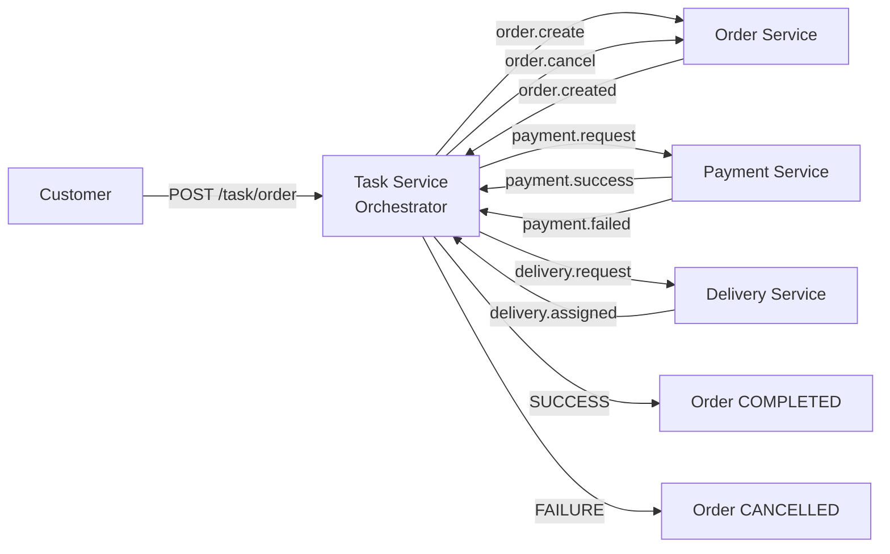

# Single Restaurant Order System - Saga Orchestration

## 1. Dinh nghia bai toan

### Domain

He thong dat mon an cho 1 nha hang (Single Restaurant Order System).

### Business process

Khach hang thuc hien chuoi xu ly:

Dat mon -> Thanh toan -> Giao hang -> Hoan tat.

### Actors

| Actor            | Vai tro                     |
| ---------------- | --------------------------- |
| Customer         | Dat don                     |
| System           | Xu ly order                 |
| Payment Service  | Thanh toan                  |
| Delivery Service | Giao hang                   |
| Task Service     | Orchestrator dieu phoi Saga |

### Scope

- Xu ly 1 don hang end-to-end.
- Khong xu ly menu phuc tap.
- Khong multi-restaurant.
- Tap trung vao Saga orchestration.

## 2. Muc tieu he thong

- Khong dung distributed transaction 2PC.
- Event-driven giua cac service.
- Co rollback khi xay ra loi o buoc thanh toan.

## 3. Saga orchestration flow

Orchestrator: Task Service.

### 3.1 Success flow (Happy path)

1. Customer tao order.
2. Order Service tao order (PENDING), phat `order.created`.
3. Task Service nhan `order.created`, gui `payment.request`.
4. Payment Service thanh toan thanh cong, phat `payment.success`.
5. Task Service nhan `payment.success`, gui `delivery.request`.
6. Delivery Service assign shipper, phat `delivery.assigned`.
7. Task Service nhan `delivery.assigned`, ket luan order `COMPLETED`.

### 3.2 Failure flow (Rollback)

1. Payment Service phat `payment.failed`.
2. Task Service nhan `payment.failed`, gui command `order.cancel`.
3. Order Service nhan `order.cancel`, cap nhat trang thai `CANCELLED`.
4. Khong tao delivery.

## 4. Danh sach command va event

### Command (Task Service gui)

| Command            | Mo ta                           |
| ------------------ | ------------------------------- |
| `order.create`     | Tao don                         |
| `payment.request`  | Yeu cau thanh toan              |
| `delivery.request` | Yeu cau giao hang               |
| `order.cancel`     | Rollback order khi payment fail |

### Event (Service phat)

| Event               | Mo ta                 |
| ------------------- | --------------------- |
| `order.created`     | Tao don thanh cong    |
| `payment.success`   | Thanh toan thanh cong |
| `payment.failed`    | Thanh toan that bai   |
| `delivery.assigned` | Da assign giao hang   |

## 5. Saga state transition

```
START
  -> ORDER_CREATED
  -> PAYMENT_PROCESSING
  -> PAYMENT_SUCCESS
  -> DELIVERY_ASSIGNED
  -> COMPLETED

PAYMENT_FAILED
  -> ORDER_CANCELLED
```

## 6. So do tong quat



## 7. Ket qua mong muon

### Success

- Order duoc tao.
- Payment thanh cong.
- Delivery duoc assign.
- Trang thai cuoi: `COMPLETED`.

### Failure

- Payment that bai.
- Order bi cancel.
- Khong tao delivery.
- Trang thai cuoi: `CANCELLED`.
